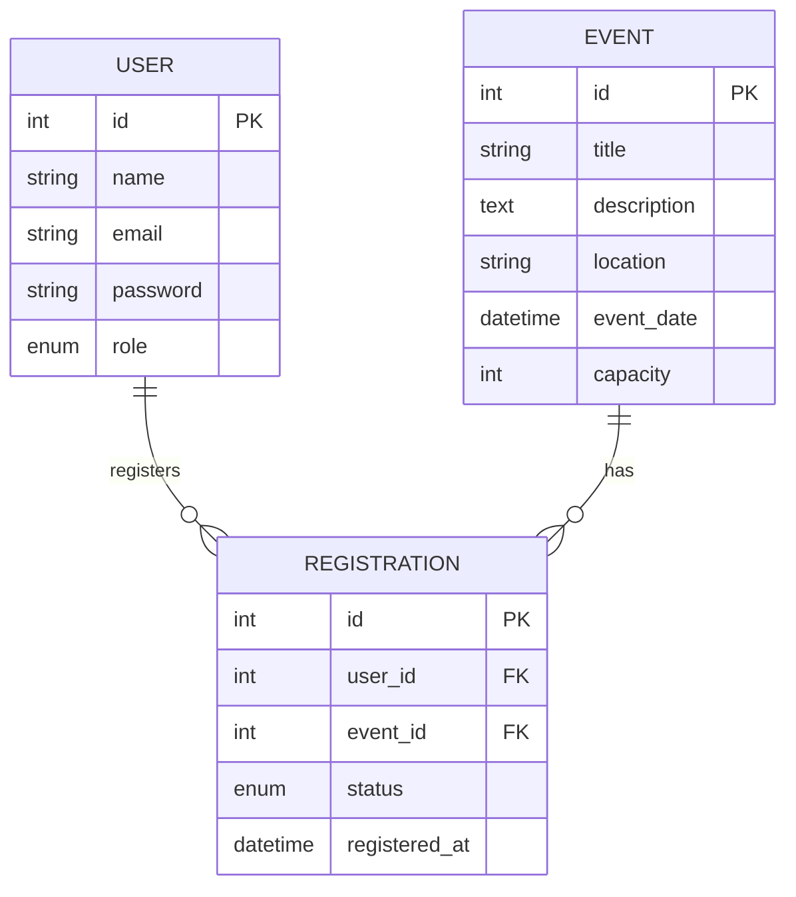

# 🎓 Event Registration System

A full-featured system for managing events and registrations, built as part of the Backend Development internship at CodeAlpha. It allows users to browse events and register for them, while organizers can add and manage events — with complete business rule enforcement and API protection via JWT Authentication.

---

## 🛠 Tech Stack

**Backend**
- Node.js + Express.js
- MySQL + Sequelize ORM
- JWT (jsonwebtoken) for Authentication
- bcryptjs for password hashing

**Frontend**
- React (Vite)
- React Bootstrap
- React Router DOM
- Axios
- React Icons

---

## 📐 ERD (Entity Relationship Diagram)



---

## 📋 Business Rules

| # | Rule | Where It's Enforced |
|---|---|---|
| 1 | Each user's email must be unique | `users.email UNIQUE` + validation in `authController` |
| 2 | A user cannot register twice for the same event | `UNIQUE(user_id, event_id)` + validation in `registrationController` |
| 3 | Registration is only allowed before the event date | Validated in `registerForEvent` |
| 4 | Event capacity cannot be exceeded | Comparing confirmed registration count to capacity |
| 5 | Event title is required | `NOT NULL` in the Model |
| 6 | Event capacity must be greater than zero | `CHECK (capacity > 0)` + `validate.min` in Sequelize |

---

## 🔐 Authentication & Authorization

- **JWT** is used to verify user identity on every protected request, via `Authorization: Bearer <token>`
- **Roles:**
  - `user`: can browse events, register for them, and manage their own registrations
  - `organizer`: in addition to the above, can add/edit/delete events

---

## 📡 API Endpoints

### Auth
| Method | Endpoint | Description | Protected? |
|---|---|---|---|
| POST | `/api/auth/register` | Create a new account | No |
| POST | `/api/auth/login` | Log in + receive Token | No |

### Events
| Method | Endpoint | Description | Protected? |
|---|---|---|---|
| GET | `/api/events` | View all events | No |
| GET | `/api/events/:id` | View event details | No |
| POST | `/api/events` | Add a new event | Yes (organizer only) |
| PUT | `/api/events/:id` | Edit an event | Yes (organizer only) |
| DELETE | `/api/events/:id` | Delete an event | Yes (organizer only) |

### Registrations
| Method | Endpoint | Description | Protected? |
|---|---|---|---|
| POST | `/api/registrations/:eventId` | Register for an event | Yes |
| PUT | `/api/registrations/cancel/:id` | Cancel a registration | Yes |
| GET | `/api/registrations/my` | View current user's registrations | Yes |

---

## ⚙️ Running Locally

### Backend
```bash
cd backend
npm install
```

Create a `.env` file:
```
PORT=5000
DB_NAME=event_registration_db
DB_USER=root
DB_PASSWORD=your_password
DB_HOST=127.0.0.1
DB_DIALECT=mysql
JWT_SECRET=your_secret_key
```

```bash
npm run dev
```

### Frontend
```bash
cd frontend
npm install
npm run dev
```

---

## 📁 Project Structure

```
backend/
├── config/
│   └── db.js
├── models/
│   ├── User.js
│   ├── Event.js
│   └── Registration.js
├── controllers/
│   ├── authController.js
│   ├── eventController.js
│   └── registrationController.js
├── routes/
│   ├── authRoutes.js
│   ├── eventRoutes.js
│   └── registrationRoutes.js
├── middleware/
│   └── authMiddleware.js
└── server.js

frontend/
└── src/
    ├── api/
    ├── components/
    ├── context/
    ├── pages/
    ├── App.jsx
    └── main.jsx
```

---

## ✍️ Developer

**Yassin Mohamed** — [GitHub](https://github.com/elshayeb507)

Project completed as part of the Backend Development internship at [CodeAlpha](https://www.codealpha.tech)
